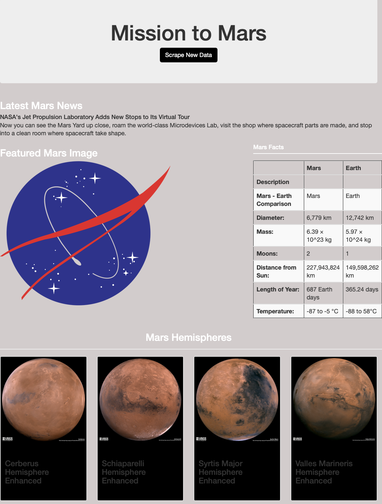

# Mission to Mars

## Purpose
The purpose of this project is to use BeautifulSoup and Splinter to scrape full-resolution images of Mars’s hemispheres and the titles of those images, store the scraped data on a Mongo database, use flask to create a web application to display the data, and alter the design of the web app in HTML to accommodate these images.

## Results
The resulting HTML site, looks as follows:
 
